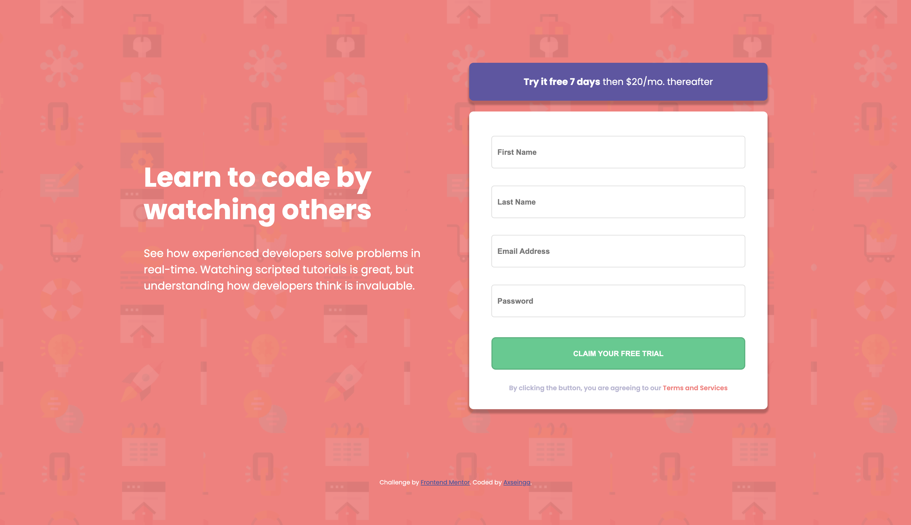

# Frontend Mentor - Intro component with sign up form solution

This is a solution to the [Intro component with sign up form challenge on Frontend Mentor](https://www.frontendmentor.io/challenges/intro-component-with-signup-form-5cf91bd49edda32581d28fd1). Frontend Mentor challenges help you improve your coding skills by building realistic projects.

## Table of contents

- [Overview](#overview)
  - [The challenge](#the-challenge)
  - [Screenshot](#screenshot)
  - [Links](#links)
- [My process](#my-process)
  - [Built with](#built-with)
  - [What I learned](#what-i-learned)
  - [Continued development](#continued-development)
  - [Useful resources](#useful-resources)
- [Author](#author)

## Overview

### The challenge

Users should be able to:

- View the optimal layout for the site depending on their device's screen size
- See hover states for all interactive elements on the page
- Receive an error message when the `form` is submitted if:
  - Any `input` field is empty. The message for this error should say _"[Field Name] cannot be empty"_
  - The email address is not formatted correctly (i.e. a correct email address should have this structure: `name@host.tld`). The message for this error should say _"Looks like this is not an email"_

### Screenshot



### Links

- Solution URL: (https://github.com/axseinga/component-signup-form)
- Live Site URL: (https://axseinga.github.io/component-signup-form)

## My process

### Built with

- Semantic HTML5 markup
- SASS
- Flexbox
- Mobile-first workflow
- BEM pattern
- vanilla javascript

### What I learned

In this project I decided to completely focus on Flexbox structure what help me to center the whole component and code it responsively. As for functionality I decided to code in plain Javascript as this is the area I am currently learning. I had a chance to refactor my code into functions and find out more about forms and automatic refreshing after user clicks submit button and how to prevent it.

```html
Some JS code I'm proud of
```

```js
submitBtn.addEventListener("click", function (e) {
  e.preventDefault();
  validateForm();
});
```

### Continued development

In next projects I want to focus more on coding in Javascript and find out if the code can be refactor further or improved in any other way. I want to read more about preventing events and form submitting.

### Useful resources

- [A Completely Guide to Flexbox](https://css-tricks.com/snippets/css/a-guide-to-flexbox/) - This page always helps me for Flexbox! It is very helpful cheat-sheet if something does not work in my code.
- [Stackoverflow](https://stackoverflow.com/) - Help me find answers for lots of small questions regarding Javascript.

## Author

- GitHub - [Axseinga](https://github.com/axseinga)
- Frontend Mentor - [@Axseinga](https://www.frontendmentor.io/profile/axseinga)
